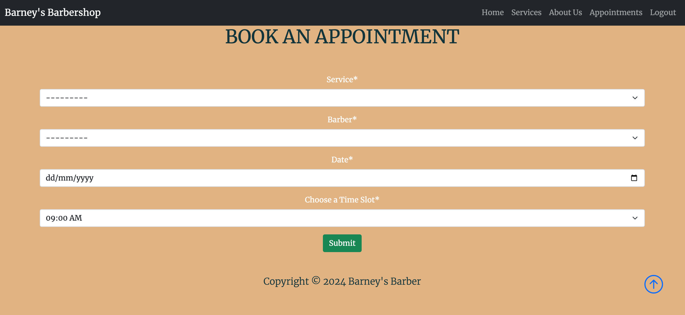

# Barney's Barbershop

[Live site](https://jh-pp4-9671216aa959.herokuapp.com/)

## User Experience

### Overview

Barbey's Barbershop is a website for a local barbershop based in Greystones, Ireland. I want to create a site that showcases what services are offered and allows users to easily book and manage appointments at their local barbershop 

#### First Time User

- I want to learn about a barbershop in Greystones
- I want to find clear and concise information about the barbers, services and price
- I want to be able to book appointments online and easily

#### Returning User 

- I want to be able to edit and delete appointments I have already booked 
- I want to view information on appointments I have had in the past so I can see who I booked with last time

### Agile

For this project I used the Agile approach to break each feature down into individual more managable, trackable bits of work. I really enjoyed using the Agile method as it helped me stay organised and on track. All of my user stories were tracked through the Github protects kanban board as can be seen below:

#### User Stories 

I used the issues feature on Github to create user stories using a custom template. Once each user story was complete, it was moved from todo to in progress to done. I had 13 user stories in total with 9 complete and 4 left to be implemented at a later date on the next sprint. 

- Completed User Stories
    - As a developer I need to set up my workspace so that create my project
    - As a user I can access a calendar so that book appointments on this website
    - As a user I want to be able to cancel my booking if I can no longer attend the appointment
    - As a developer I want to set up all auth so that people can register as a user on my website to access booking features
    - As a developer I need to create the front end home page for my site
    - As a user I want to have the ability to edit bookings so I can change the date or time
    - As a developer I want to add a services page so the user can view services offered and their prices
    - As a developer I want to deploy my live site to Heroku
    - As a user I can create an account so that I can create, view, edit and delete appointments

- Incomplete User Stories
    - As a developer I want to limit appointment times so only 1 user can book each time slot
    - As a developer I can create a custom 404 page so that the 404 page is in line with the design of the rest of the site
    - As a userI can verify my email so that I can receive emails from the barbershop
    - As a user I can request a password reset email so that I can log into the account is I forget my password

All user stories can be viewed in full detail [here](https://github.com/users/JasonHorgan/projects/4)

## UI 

I made a quick Wireframe before my first meeting with my mentor to discuss project inception so I would have a rough idea of how I wanted to look, which can be seen below:

In the end I created 8 custom HTML pages, including the Base.html page, which can be seen below:

The index page is the home page where the user can find information about the barbershop and includes a book now button. If the user is not logged in and clicks the book now button, they are directed to the sign in page. If they do not have an account, they can also sign up for an account from here. 
If the user is logged in when they click te book now button, they are directed to the create appointment page where they can book an appointment. 
On succesful booking of an appointment, the user is then directed to the profile page, where they can view their appointments. This can be seen in the screenshots below. 

The Nav Bar Alo changes depending on logged in state. If the user is logged in, they will see the following Nav Bar:

If the user is logged out, the navbar will appear like so:

If the user clicks on the 'Delete Appointment' button, I have added some defensive programming for good user experience so they are required to confirm cancellation before the appointment is cancelled:

## Testing

Manual testing was done for this project and all the info can be found [here](https://github.com/JasonHorgan/barbershop-pp4/blob/main/TESTING.md)

### Bugs

I encountered a lot of bugs in the development of this project, but as far as I can tell, there are no bugs currently on the live deployed site. Django's built in debug feature was used a lot during development, particulary when writing my views, to help debug any issues that arised.

## Deployment

This project was deployed using Heroku. Full details of deployment seen below:

Part 1 - Create the Heroku app:

Navigate to your Heroku dashboard and create a new app with a unique name in a region close to you.
In your new app’s settings tab, ensure the Config Var DISABLE_COLLECTSTATIC key has a value of 1.
Part 2 - Update your code for deployment:

Use pip3 to install gunicorn~=20.1 and freeze it to the requirements.txt file.
In the settings.py file, set the DEBUG constant to False and append the '.herokuapp.com' hostname to the ALLOWED_HOSTS list.
Git add, commit and push the code to your GitHub repo.

Part 3 - Deploy to Heroku:

In your new app’s Deploy tab, search for your GitHub repo and connect it to the Heroku app. Manually deploy the main branch of this GitHub repo.
In your new app’s resources tab, ensure you are using an eco dyno and delete any Postgres database Add-on.

### Django Secret Key

The secret key was generated using a secret key generator online. It was then set as an environment variable and stored in env.py, as advised in the course material. 

### Database 

The database used for this project was PostgreSQL from Code Institute and was connected following the steps outlined in the course material. 

## Credits

### Content 

I used Chat GPT to write the bios of the barbers and general content of the web pages, as well as the image on the about page. I took the photos of the barbers from royalty free image site Pexels. 

### Code

- The general Django set up was done by following the Code Institute's walkthrough "I think, therefore I blog"
- I used this video to help guide me through Bootstrap for the base and html page: https://www.youtube.com/watch?v=4sosXZsdy-s
- I used this video to help guide me through Bootstrap for the services page: https://www.youtube.com/watch?v=PwEvMY7nnY8
- Bootstrap 5 library was used a lot for this project's general layout. 
- I watched a lot of videos from the Django Wednesday series on this channel to help me get a better understanding of how   Django works in general, but particulary with the CRUD functionality on my site: https://www.youtube.com/playlist?list=PLCC34OHNcOtqW9BJmgQPPzUpJ8hl49AGy
- I used [STACK OVERFLOW](https://stackoverflow.com/) quite a bit when it came to helping me understand debug error messages 
- [W3SCHOOLS](https://w3schools.com/) was used as a guide to help me understand Django and its features - 
I used chat gpt to help me with the messages in Django but the code was wrong so I had to re-write it with a combination of help from stack overflow, W3 Schools and the Django Wednesdays blog mentioned above.
- Code in my profile.html page was written with the guidance of the blog list in "I think, therefore I blog"

### Acknowledgements

- I want to thank my mentor Graham for his constant guidance and support through the course so far and with this project. 
- I also want to thank my cohort facilitator Marko for constantly checking in to make sure I have all the resources I need and always offering a helping hand if I need it. 
