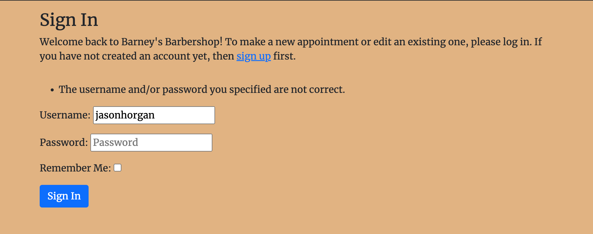
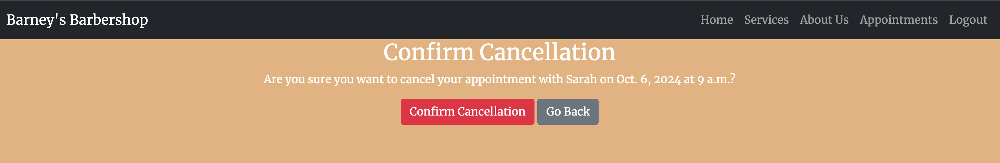
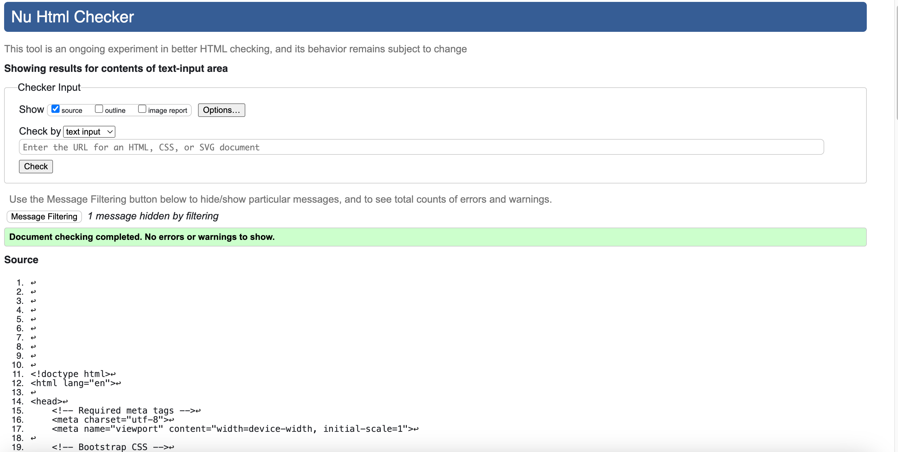
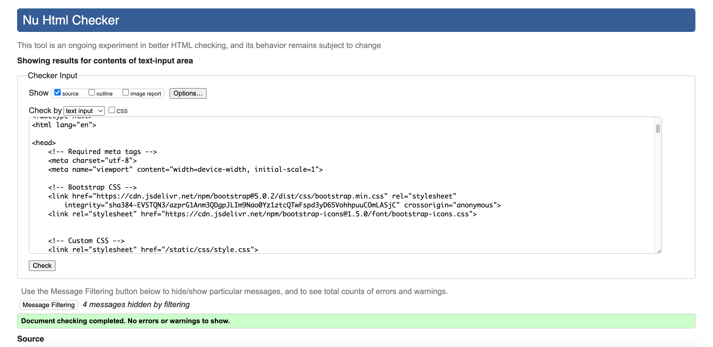

# Testing Page

**Authentication**

Description:

Ensure a user can sign up to the website

Steps:

1. Navigate to [Barney's Barbershop Sign in](https://jh-pp4-9671216aa959.herokuapp.com/accounts/login/) and click Sign up
2. Enter email, username and password (optional)
3. Enter Password again
4. Click Sign up

Expected:

If sign up is succesfull, users are directed to the home page. 

If sign up is unsuccesfull, users should be told why, ID, passwords do not match, and are prompted to try again

Result:

Working as expected.

Description:

Ensure that registered users are able to log in.

Steps:
1. Navigate to [Barney's Barbershop Sign in](https://jh-pp4-9671216aa959.herokuapp.com/accounts/login/) and click Sign up
2. Enter login details
3. Click login

Expected:

User is successfully logged in and redirected to the home page, but if their log in details are incorrect, they see an error message letting them know something is wrong

Result:

Working as expected.

Description:

User's can sign out

Steps:

1. User logs into their account
2. User clicks the sign out button
3. User clicks sign out button again when asked to reconfirm

Expected:

User is logged out and brought back to home page

Result:

Working as expected

**Forms**

Description:

Logged in Users can book an appointment

Steps:

1. Navigate to [Book an appointment]( https://jh-pp4-9671216aa959.herokuapp.com/book_appointment/ ) 
2. Fill in all entries on the form
3. Click Submit

Expected:

Form is saved and user is redirected to the profile page where they can see all of their appointments

Actual:

Working as expected

 

Description:

Users can edit appointments

Steps:

1. Navigate to [Profile Page](https://jh-pp4-9671216aa959.herokuapp.com/profile/) 
2. Click Edit Booking on one of the appointments
3. Edit any of the form selections
4. Click Update Appointmet booking

Expected:

Form successfully submits and user is redirected to the profile page where they can see a message advising their appointment has been updated, or else they are told there is an error and need to fill in the form correctly

Result:

Working as expected

Description:

Users can delete appointments 

Steps:
1. Login as a user who has an appointment created
2. Click profile in the nav bar 
3. Click the delete booking button on an appointment
4. User is redirected to delete appointment page
5. Click the confirm cancellation button on the delete page
6. User is redirected to the profile page

Expected:

Booking is successfully deleted

Result

working as expected

**Navigation Links**

Testing was performed to ensure all navigation links on the respective pages, navigated to the correct pages as per design. This was done by clicking on the navigation links on each page.

Home -> index.html - Visible to anyone

Services -> services.html - Visible to anyone

About us -> about.html - Visible to anyone

Register -> signup.html - visible to anyone

Login -> login.html - Visible to anyone

Appointments -> profile.html - Only visible to logged in users, otherwise redirect to sign in page

book_appointment.html - only visible to users who are logged in, otherwise redirect to sign in page 

edit_appointment - only visible to users who are logged in, otherwise redirect to sign in page. If appointment is not owned by the user who booked it, not found page

## Validation 

All custom HTML pages were put through a HTML validator and passed with no errors. Screnshots below

All customer HTML pages were Lighthouse tested and passed these tests too. Screenshots below

CSS was put through a validator and passed with no issues

Views.py was put through the CI Python Linter with no issues:

